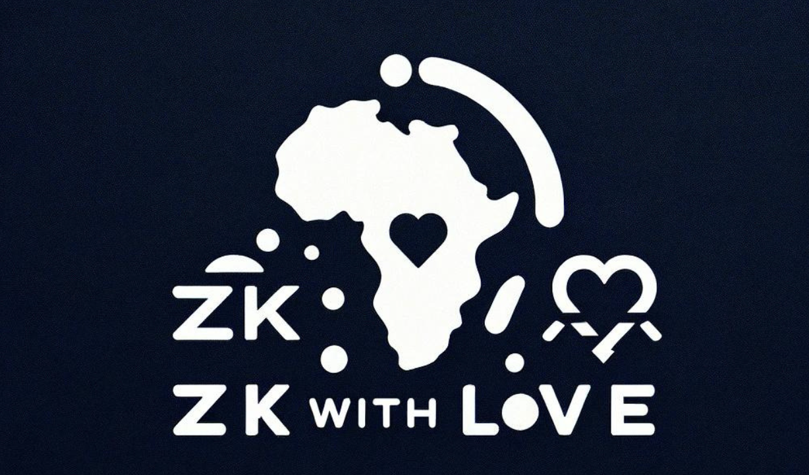

ZK With Love provides private and trustless donations to Africa (or anyone in need) using zero knowledge and stable coins (USDC). 

Donators can send USDC to an escrow account. Recipients of the donation can prove their identity by providing a correct donation code. This removes the need for waste in the donation from negligence, greed, or fraud. 

## What does this solve? 
By [�UN](https://www.un.org/sg/en/content/sg/statement/2012-07-09/secretary-generals-closing-remarks-high-level-panel-accountability) estimations, only 30% of development assistance reaches its final destination.  The final destination is individuals who need it the most. Instead of trusting centralized sources of distribution (governments/NGOs)  or P2P payments that aren't scalable, "From ZK With Love" provides a trustless way to donate. 

## How Does it Work? 

**Step 1:**

A donor will send an amount of USDC to an escrow contract that is deployed on the Celo Testnet. 

**Step 2:**

The receiver gets an email that funds have been deposited to an escrow that they are eligible to get funds.  The notification includes a Donation Code. (not implemented) 

**Step 3:**

The receiver goes to the MiniPay app and enters their Donation Code. This generates a ZK Proof or rejection if the correct code is given. 

**Step 4:**

The ZK Proof, the wallet address of the user, and the generation code are then sent to the Escrow contract. The escrow account sends a USDC amount to the receiver. 

## Next Steps 
Build out a notification system for the receiver. 

Complete frontend integration of sending the proof 

Explore wallet options on Circle when Celo is supported. 

